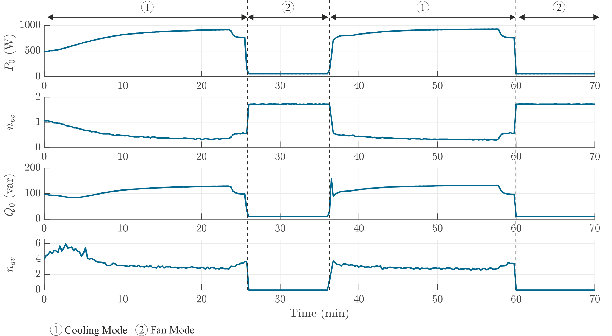

# Air Conditioner

During the test, the air conditioner worked consistently in cooling mode with maximum wind level. The tested air conditioner can only operate in cooling mode (compressor operates) or fan mode (compressor does not work, the AC operates like a fan)

