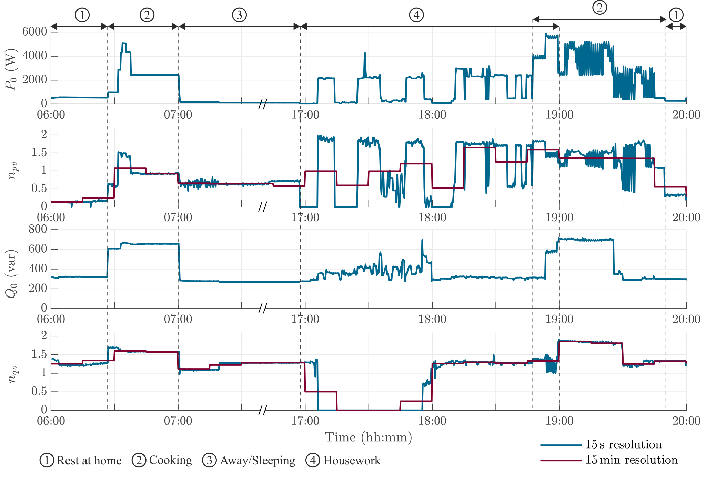
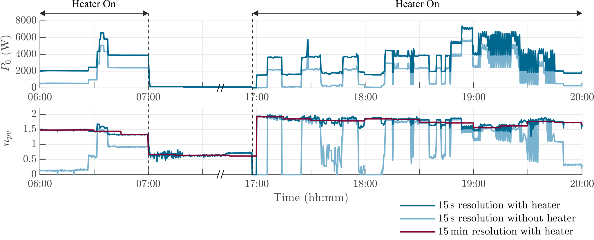

# Voltage Sensitivity Profiles of an Apartment

The power consumption of a 2-person apartment over 24 hours is reconstructed with an apartment-like laboratory. The voltage sensitivity profiles under 2 scenarios are provided.

## Scenario 1: 24-hour Power and Voltage Sensitivity Profile 
The time-varying voltage sensitivity of an apartment is shown in the figure below, the 5-hour test can be separated into 4 power consumption scenarios: cooking, housework, away/sleeping, and rest at home, marked out with dashed lines and numbers. Cooking involves loads such as stoves, ovens, toasters, etc. Housework involves loads like washing machines, dishwashers, vacuum cleaners, etc. The power consumption during away and sleeping is similar, mainly from loads like fridges and freezers and the standby power of other loads. When the user is at home with low power consumption, such as working from home or watching TV, it is categorized as rest at home.
- During the experiment, the fridge and the freezer were always running. 
- In the first time slot, halogen lights are turned on as the users wake up.
- The second slot presents cooking time for breakfast, where the induction stove, water kettle, and toaster are switched on one after another. The latter two appliances are turned off after a few minutes and the induction stove operates until 7:00. 
- During the third time slot, the users leave for work and only the fridge and freezer are on. 
- During the fourth time slot, the washing machine, dishwasher, and cloth dryer operate. DuThey have multiple operating phases during an operating cycle
- Another cooking phase for dinner preparation occurs in the fifth time slot, during which the oven, induction stove, and cooker hood are used. The oven causes frequent and large active power and Kpv variation, which will not be overseen with minute range resolution.
- The last time slot is similar to the first one with fewer halogen lights turning on.
  

## Scenario 2: Aggregate an Electrical Heater to the Power Profile
To observe how the power profile changes if an electrical heater is used for heating in winter, which is quite common for countries such as France.

The aggregation is only conducted for active power as the reactive power of the electrical heater is very low. The aggregated power profile and $K_{pv}$ profile can be observed below

