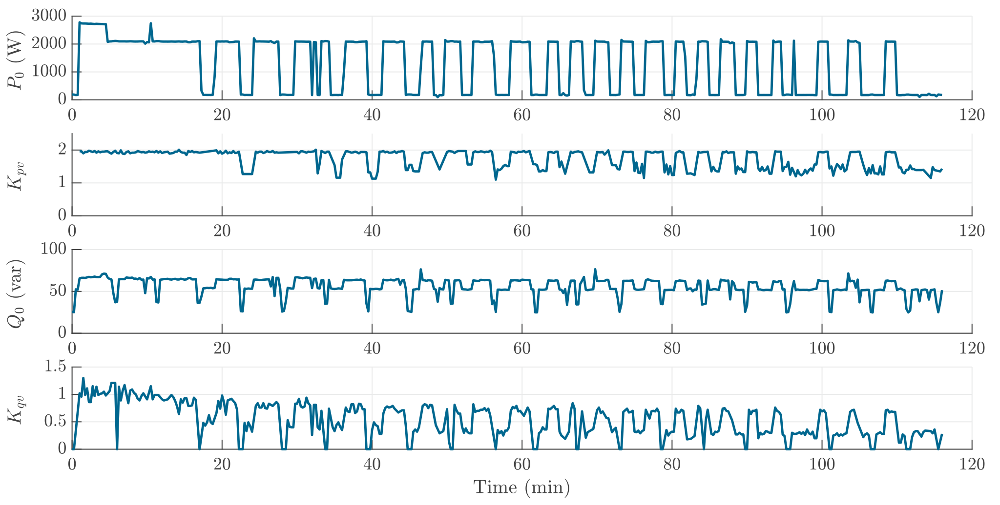

# Cloth Dryer
The heating element of the cloth dryer can be considered as a big resistor. It consumes much more power than the other components of the cloth dryer, such as the motor. In the warm-up phase, the cloth dryer seeks to increase the temperature and the heating element operates consistently. When the temperature is reached, the drying cycle starts. where the heating element is turned on and off periodically to keep the temperature and remove the humidity from the clothes.   

