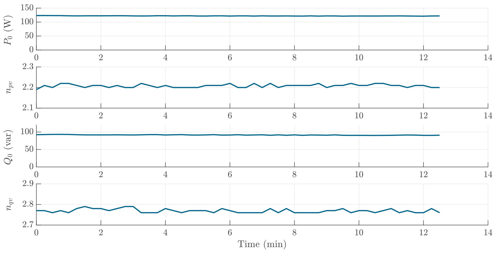

# Cooker Hood

The main operating component of the cooker hood is a ventilator, which operates consistently. Therefore, a relatively constant operating power and voltage sensitivity value are observed. 

