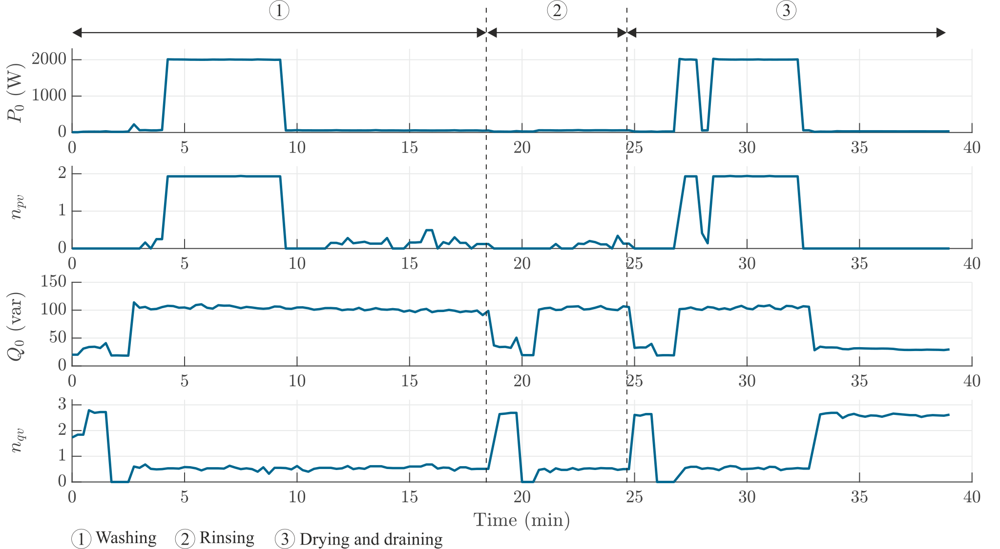

# Dishwasher

The operation cycle of the dishwasher contains three main operating phases: a washing phase, a rinsing phase, and a drying and draining phase. The heating element, the circulation pump, and the spray arm motor are the three main elements of a dishwasher. The heating element can be considered as a big resistor and dominates the active power-to-voltage sensitivity of the dishwasher. Meanwhile, the motors dominate the reactive power-to-voltage sensitivity. In the washing and drying phase, the heating element operates, the active power reaches 2000 W and a $n_{pv}$ of almost 2 is observed, indicating a constant impedance load behavior. Furthermore, when the circulation pump and the spray arm motor (both uncontrolled motors) operate, the reactive power reaches 100 Var and a $n_{qv}$ around 0.3 is observed.

!
