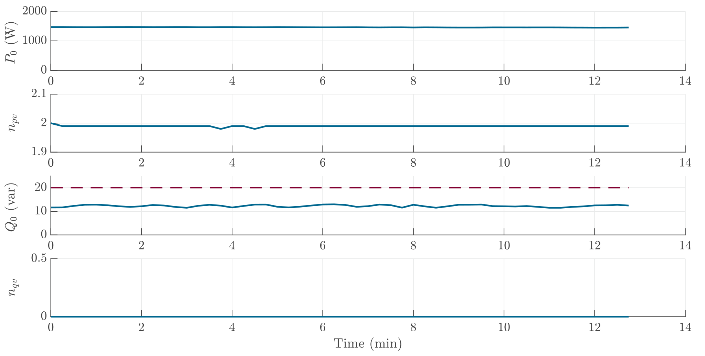

# Electric Hot Plate

The electric hot plate can be considered as a resister. Therefore, a constant $n_{pv}$ value of 2 is observed. The reactive power consumption of the hot plate is lower than the minimum calculation power (20 Var, see the red dashed line) for good accuracy. Thus, the $n_{qv}$ is not calculated and is neglected (set to 0).

!
