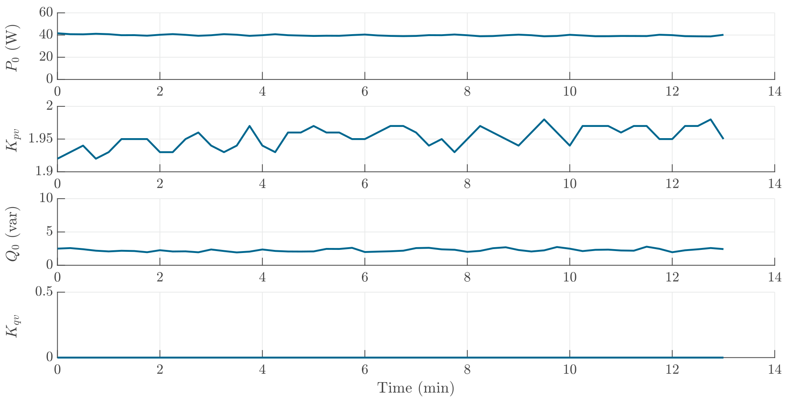

# Fan
A fan has a relatively constant operating power and voltage sensitivity at a fixed power level. Notice that Kqv was set to 0 (neglected) as the reactive power consumption is below the minimum power limitation.

