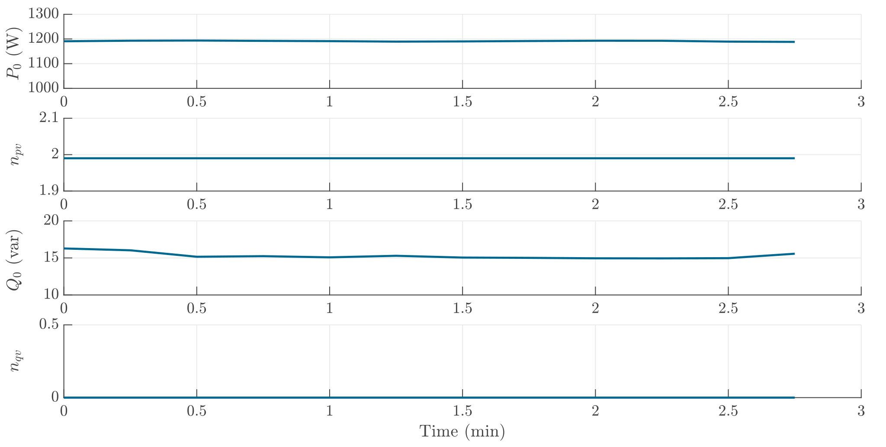

# Hair Dryer
When the warm wind operation mode is selected, a hair dryer can be considered as a resistor, therefore showing $n_{pv}$ equals 2. The reactive power consumption of the hair dryer is lower than the minimum power (20 Var) and therefore $n_{qv}$ is neglected and considered as 0 for accuracy purposes. 

