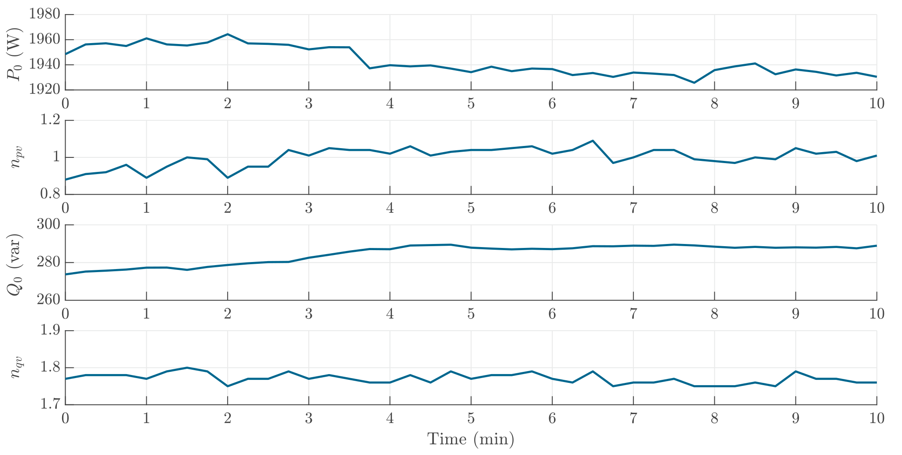

# Induction Stove
The active power of the induction stove is under current control, therefore a $n_{pv}$ value of around 1 was observed. The reactive power relationship to voltage can be considered as uncontrolled.

