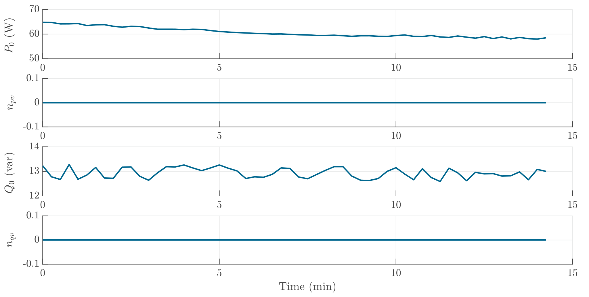

# LED Ceiling Light
LED lights are powere electronic-based appliances, the active power consumption will not be influenced by variations in voltage magnitude. As the reactive power is smaller than 20 var, for accuracy purposes, $n_{qv}$ is neglected and considered 0.

