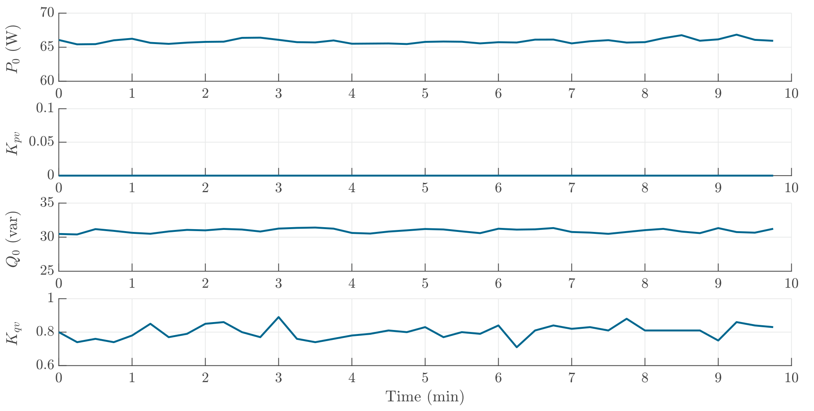

# Laotop Charger
The active power of the laptop charger is actively controlled. Therefore, it shows no dependency on voltage. The power factor of the device, namely the reactive power is not controlled. 

