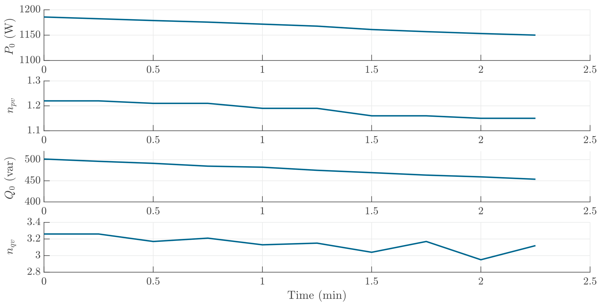

# Microwave Oven
Microwave ovens often work at switching mode, namely the power profile will jump between high power consumption and almost 0. However, the voltage sensitivity profile below is updated every 15 s, which is much lower than the switching period of the microwave oven. Therefore, the switching of power is not observed in the provided power profile below.

