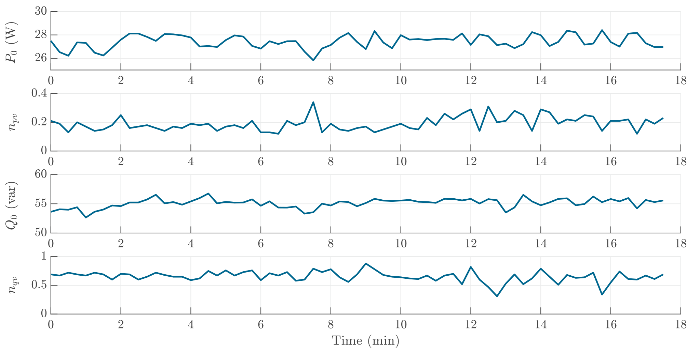

# Monitor
The power factor of the monitor is not controlled and it has a non-sinusoidal current waveform, which contains a lot of harmonics. Here the reactive power is calculated using Q = \sqrt(S2 - P^2)

