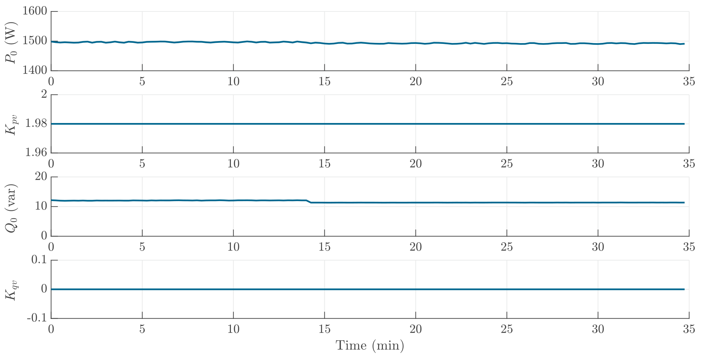

# Oil Radiator
Please note that the oil radiator is only tested for around 35 minutes here, which is not enough for the radiator to heat up the lab. Therefore, the radiator is always on. In reality, the radiator will stop working when the temperature is reached and will not work consistently throughout the day. 

