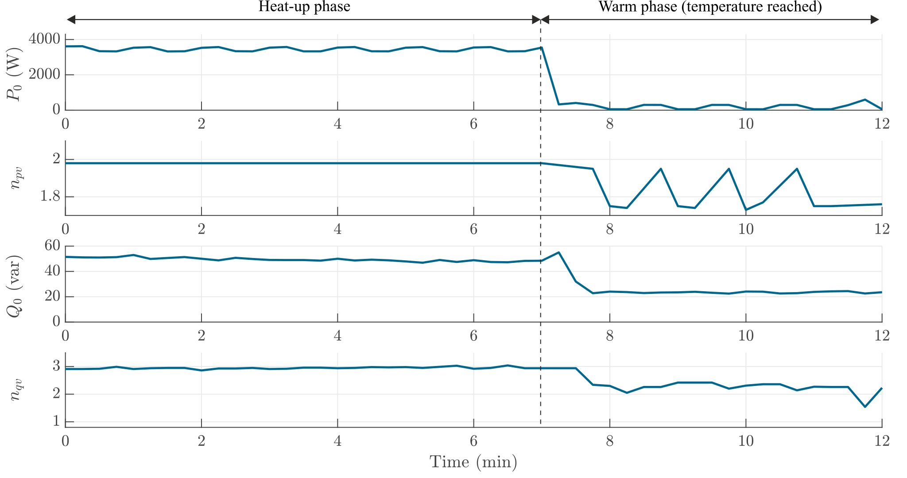

# Oven
When the oven is turned on all the heating elements operate and the oven reaches 3600 W and 50 var. When the oven reaches the set temperature, it starts to operate in the heat-insulating mode with lower power. During the operation, although the heating mode changes and $P_0$ decreases dreadfully, the $K_{pv}$ remains around 2. This is due to the fact that the voltage sensitivity describes the physical characteristic of a load and the oven remains in a constant impedance behavior in both modes. The ventilator has a lower active and reactive power-to-voltage sensitivity. As the power share, namely the impact of the ventilator increases during the heat-insulating phase, a small reduction in $K_{pv}$ and a large reduction in $K_{qv}$ are observed.

