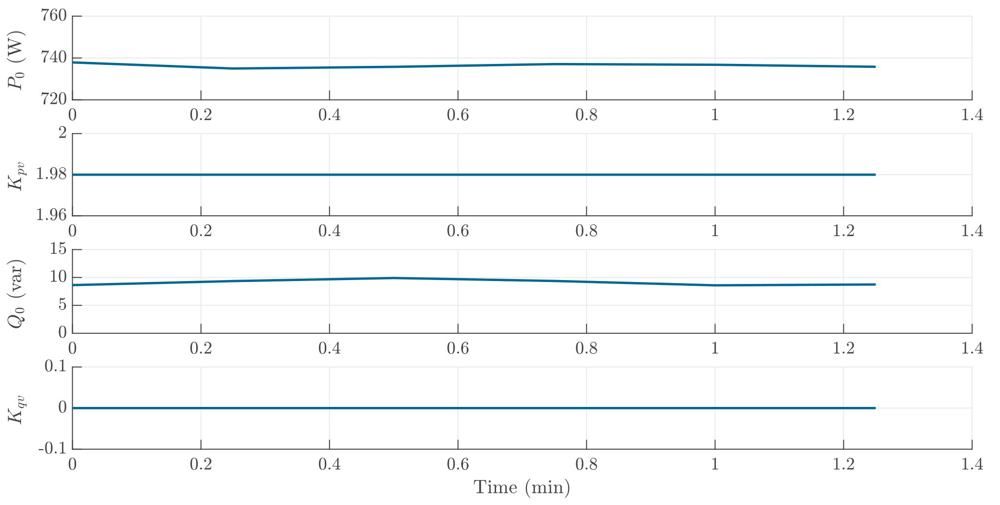

# Toaster
The toaster can be considered as a resistive load, which has a very high active power consumption and a reactive power consumption of close to 0. It shows a $n_{pv}$ close to 2. $n_{qv}$ is neglected and considered 0 as the reactive power is below the minimum power for sensitivity calculation

