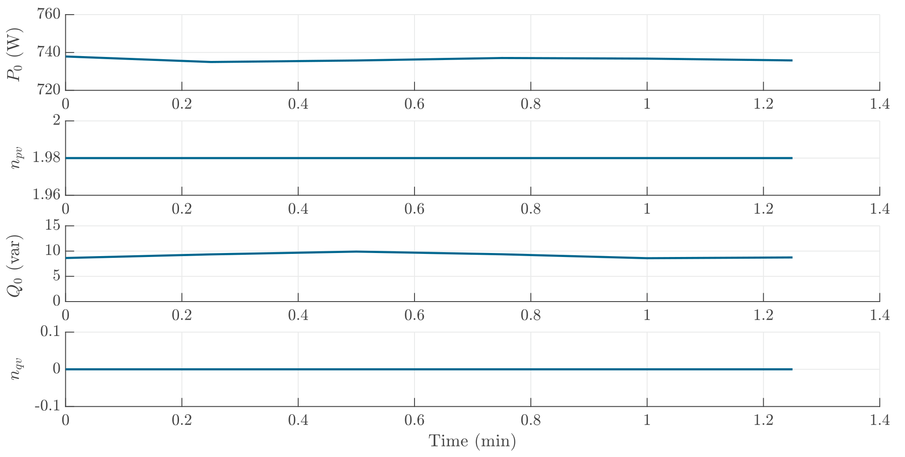

# Toaster
The toaster can be considered as a resistive load, which has a very high active power consumption and a reactive power consumption of close to 0. It shows no reactive power dependency on voltage ($n_{qv}=0$) and a $n_{pv}$ close to 2.

