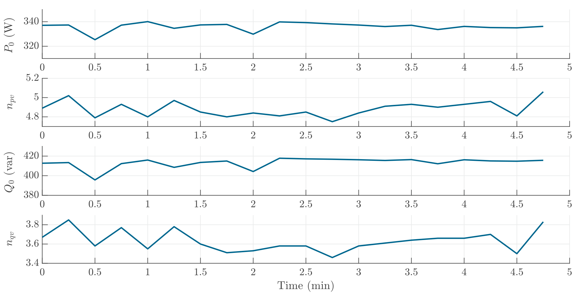

#     Vacuum Cleaner
The vacuum cleaner can be considered as an uncontrolled directly connected motor. Therefore, it shows quite high values of voltage sensitivity for both active and reactive power. The high reactive power is due to the poor current waveform, namely the high share of harmonics. 

