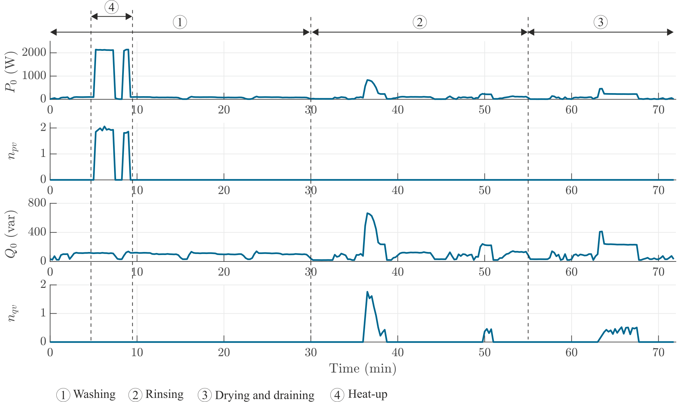

#     Washing Machine

The operating cycle of a washing machine is usually composed of several operating phases, such as a pre-wash and heat-up phase, a laundry phase, and a drying phase. For the pre-wash, laundry, and drying phases, the motor is the main operating component and shows similar power consumption and sensitivity values. During the heat-up phase, the resistor with much higher power consumption dominates the voltage sensitivity value. Thus, a high $n_{pv}$ of almost 2 was observed.

